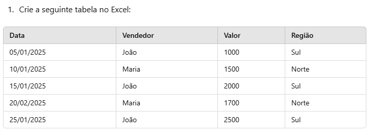

## Aula 02
#### Correção da AV - Diagnóstica

#### Conhecimentos:
- 1.2.  Estatísticas 
- 1.2.1.  Contases 
- 1.2.2.  Médiases 

### Exercícios práticos para explorar as funções estatísticas CONT.SES e MÉDIASES no Excel:

##### - Exercício 1: CONT.SES — Contagem Condicional Múltipla
Descrição: Contar quantos pedidos foram realizados em janeiro por vendedores específicos.




=CONT.SES(A:A; ">=01/01/2025"; A:A; "<=31/01/2026"; B:B; "Maria")

##### - Exercício 2: MÉDIASES — Média Condicional Múltipla
Descrição: Calcular a média dos valores de vendas de João realizadas na região Sul.

```
=MÉDIASES(C:C; B:B; "João"; D:D; "Sul")
```

##### - Exercício 3: CONT.SES com múltiplos critérios personalizados
Descrição: Contar quantos pedidos foram feitos em regiões diferentes de "Sul" e com valores superiores a R$ 1.500,00.

```
=CONT.SES(D:D; "<>Sul"; C:C; ">1500")
```

#### - Exercício 4: MÉDIASES com faixa de datas
Descrição: Calcular a média das vendas realizadas em janeiro.

```
=MÉDIASES(C:C; A:A; ">=01/01/2025"; A:A; "<=31/01/2025")

```

#### Conhecimentos:

- 1.3.   Datas  
- 1.3.1.  Diadasemana 
- 1.3.2.  Diatrabalho 
- 1.3.3.  Diatrabalho.intl 
- 1.3.4.  Diatrabalhototal 
- 1.3.5.  Diatrabalhototal.intl 
- 1.3.6.  Dias360 
- 1.3.7.  Datadif 


##### Exercício 1: Uso de DIADASEMANA
```
Descrição: Determine o dia da semana correspondente a uma data.


Insira a data "28/01/2025" na célula A1.

Na célula B1, use a função DIADASEMANA para identificar o dia da semana dessa data com tipo de retorno 2 (Segunda-feira = 1).
```

##### Exercício 2: Uso de DIATRABALHO
```
Descrição: Calcule uma data futura considerando apenas dias úteis.

Insira "28/01/2025" na célula A1.

Na célula B1, use a função DIATRABALHO(A1, 10) para calcular a data 10 dias úteis após essa data.
```
##### Exercício 3: Uso de DIATRABALHO.INTL
```
Descrição: Calcule uma data futura ignorando fins de semana personalizados.

Insira "28/01/2025" na célula A1.

Na célula B1, use a função DIATRABALHO.INTL(A1, 15, 11) (onde 11 exclui apenas domingos como dia não útil) para calcular a data 15 dias úteis após a data inicial.
```

##### Exercício 4: Uso de DIATRABALHOTOTAL
```
Descrição: Conte o número de dias úteis entre duas datas.

Insira "01/01/2025" na célula A1 e "31/01/2025" na célula B1.

Na célula C1, use DIATRABALHOTOTAL(A1, B1) para contar quantos dias úteis existem nesse período.
```

##### Exercício 5: Uso de DIATRABALHOTOTAL.INTL
```
Descrição: Conte o número de dias úteis entre duas datas com fins de semana personalizados.

Insira "01/01/2025" na célula A1 e "31/01/2025" na célula B1.

Na célula C1, use DIATRABALHOTOTAL.INTL(A1, B1, 1) (onde 1 exclui sábados e domingos) para contar os dias úteis.
```

##### Exercício 6: Uso de DIAS360
```
Descrição: Calcule a diferença em dias entre duas datas com base em um ano de 360 dias.

Insira "01/01/2025" na célula A1 e "31/12/2025" na célula B1.
Na célula C1, use DIAS360(A1, B1) para calcular a diferença em dias.
```
##### Exercício 7: Uso de DATADIF
```
Descrição: Calcule a diferença entre duas datas em meses, anos e dias.


Insira "01/01/2020" na célula A1 e "28/01/2025" na célula B1.
Use as seguintes fórmulas:
=DATADIF(A1, B1, "Y") (Anos)
=DATADIF(A1, B1, "M") (Meses)
=DATADIF(A1, B1, "D") (Dias)
```